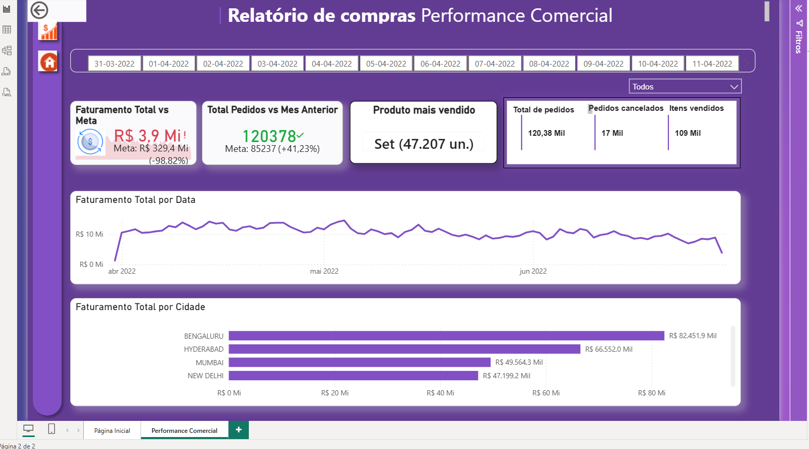

# 📊 [Nome do Projeto]: Dashboard de [Tema Principal, ex: Análise Financeira / Vendas]


> **Projeto Prático de Portfólio:** Desenvolvido para consolidação e aplicação de conceitos teóricos de Business Intelligence, ETL, modelagem relacional de dados e Design de Dashboards.

---

## 📸 Visualização do Dashboard

<div align="center">
  
</div>

---

## 📌 Visão Geral & Problema de Negócio

O objetivo deste projeto foi resolver um cenário real de análise de dados para a tomada de decisão estratégica em [Descreva o contexto do negócio, ex: uma rede varejista com alto volume de vendas regionais]. 

A solução em Power BI substitui relatórios estáticos em planilhas por um painel dinâmico e interativo, permitindo acompanhar indicadores operacionais, tendências temporais e gargalos no fluxo de dados.

### 🎯 Principais Objetivos:
- Centralizar o acompanhamento de métricas-chave (KPIs).
- Permitir filtros cruzados para análise por período, categoria e região.
- Oferecer uma navegação fluida com foco em **UI/UX (User Interface e User Experience)** e acessibilidade visual.

---

## 🛠️ Conhecimentos Teóricos Aplicados & Metodologia

Este projeto abrangeu todo o fluxo do ciclo de vida de dados em Business Intelligence:

### 1. Conexão & Tratamento de Dados (Power Query / ETL)
- **Extração:** Carga e integração de fontes de dados [ex: arquivos CSV / tabelas Excel / Banco de Dados Relacional].
- **Tratamento:** Limpeza de dados, remoção de duplicatas, adequação de tipos de dados (Data Types) e criação de colunas condicionais/personalizadas.
- **Otimização:** Organização de etapas aplicadas para melhor desempenho do modelo.

### 2. Modelagem de Dados (Star Schema)
- Construção de modelo relacional seguindo a arquitetura **Star Schema (Esquema em Estrela)**.
- Criação de **Tabelas Fato** (registros de eventos/transações) e **Tabelas Dimensão** (contextos e atributos).
- Criação de uma **Tabela D’Calendário** em DAX para permitir inteligência temporal (*Time Intelligence*).
- Ajuste de cardinalidade de relacionamentos (1:N) e direção do filtro cruzado (Single/Único).

### 3. Métricas e Cálculos (DAX)
Desenvolvimento de medidas analíticas utilizando Data Analysis Expressions (DAX):
- **Cálculos Agregados:** `SUM`, `AVERAGE`, `COUNTROWS`, `DISTINCTCOUNT`.
- **Modificadores de Contexto:** `CALCULATE`, `ALL`, `FILTER`, `USERELATIONSHIP`.
- **Inteligência Temporal (Time Intelligence):** `SAMEPERIODLASTYEAR`, `DATEADD`, `YTD`, `TOTALYTD`.
- Uso de boas práticas na organização de medidas em **Tabelas de Medidas isoladas**.

### 4. Design, Layout & Storytelling
- Princípios de **Storytelling com Dados** para hierarquização da informação.
- Aplicação de **Scannability** (leitura em Z/F) colocando KPIs de topo no topo da tela.
- Padronização de paleta de cores para contraste visual adequado.

---

## 💡 Estrutura de Métricas no Painel

| Categoria | Indicadores / Métricas |
| :--- | :--- |
| **Métricas Principais (KPIs)** | [Ex: Faturamento Total, Volume de Vendas, Ticket Médio] |
| **Comparativos Temporais** | [Ex: Crescimento YoY (Year-over-Year), Variação % Mensal] |
| **Segmentações** | [Ex: Análise por Categoria, Canal de Distribuição, Região Geográfica] |

---

## 📂 Estrutura do Repositório

```text
├── assets/
│   └── dashboard_preview.png    # Captura de tela do painel final
├── data/
│   └── dataset_ficticio.csv     # Conjunto de dados para demonstração (sem dados sensíveis)
├── src/
│   └── dashboard.pbix           # Arquivo do Power BI (opcional)
├── LICENSE
└── README.md                    # Documentação do projeto
